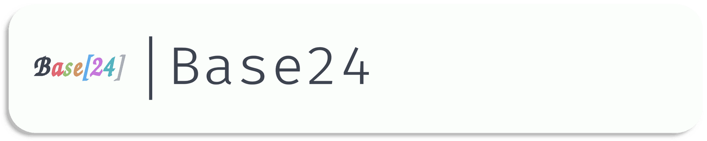

[](../../)
[](https://www.codacy.com/gh/Base24/Base24.github.io)
[](../../)
[](../../issues)
[](/LICENSE.md)
[](../../commits/master)
[](../../commits/master)

<!-- omit in TOC -->
# Base24.github.io



Search for templates and schemes and link to projects.


- [Language information](#language-information)
- [Download](#download)
	- [Clone](#clone)
		- [Using The Command Line](#using-the-command-line)
		- [Using GitHub Desktop](#using-github-desktop)
	- [Download Zip File](#download-zip-file)
- [Community Files](#community-files)
	- [Licence](#licence)
	- [Changelog](#changelog)
	- [Code of Conduct](#code-of-conduct)
	- [Contributing](#contributing)
	- [Security](#security)
	- [Support](#support)
- [Screenshots](#screenshots)
	- [Desktop](#desktop)
	- [Mobile](#mobile)
	- [Themes](#themes)
- [Browser Support](#browser-support)
	- [Supported](#supported)
	- [Unsupported](#unsupported)


## Language information
Base24.github.io is built with JS, HTML5 and CSS3


## Download
### Clone
#### Using The Command Line
1. Press the Clone or download button in the top right
2. Copy the URL (link)
3. Open the command line and change directory to where you wish to clone to
4. Type 'git clone' followed by URL in step 2
```bash
$ git clone https://github.com/[user-name]/[repository]
```

More information can be found at https://help.github.com/en/articles/cloning-a-repository

#### Using GitHub Desktop
1. Press the Clone or download button in the top right
2. Click open in desktop
3. Choose the path for where you want and click Clone

More information can be found at https://help.github.com/en/desktop/contributing-to-projects/cloning-a-repository-from-github-to-github-desktop

### Download Zip File

1. Download this GitHub repository
2. Extract the zip archive
3. Copy/ move to the desired location


## Community Files
### Licence
MIT License
Copyright (c) Base24
(See the [LICENSE](/LICENSE.md) for more information.)

### Changelog
See the [Changelog](/CHANGELOG.md) for more information.

### Code of Conduct
In the interest of fostering an open and welcoming environment, we
as contributors and maintainers pledge to make participation in our
project and our community a harassment-free experience for everyone.
Please see the
[Code of Conduct](https://github.com/Base24/.github/blob/master/CODE_OF_CONDUCT.md) for more information.

### Contributing
Contributions are welcome, please see the [Contributing Guidelines](https://github.com/Base24/.github/blob/master/CONTRIBUTING.md) for more information.

### Security
Thank you for improving the security of the project, please see the [Security Policy](https://github.com/Base24/.github/blob/master/SECURITY.md) for more information.

### Support
Thank you for using this project, I hope it is of use to you. Please be aware that
those involved with the project often do so for fun along with other commitments
(such as work, family, etc). Please see the [Support Policy](https://github.com/Base24/.github/blob/master/SUPPORT.md) for more information.


## Screenshots

### Desktop
|Screenshots|
|:-:|
|  |
|  |
|  |


### Mobile
|Screenshots| |
|:-:|:-:|
|  |  |
|  |  |


### Themes
|Light|Dark|Black|
|:-:|:-:|:-:|
|  |  |  |


## Browser Support

### Supported
Base24 PWA is built with the following browsers in mind:
Google Chrome


Chromium Based Browsers


Safari


Microsoft Edge (Chromium)


### Unsupported
Base24 PWA is not designed for the following browsers
(though they may still run as expected in some cases, such as on
Firefox). Functionality and visuals may not work as expected:
Firefox


Microsoft Edge (EdgeHTML)


Internet Explorer


TOR Browser


Other Browsers


